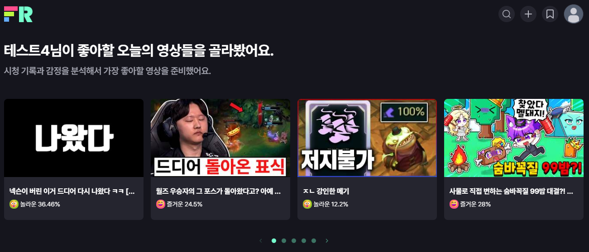
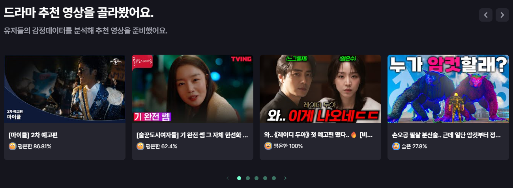
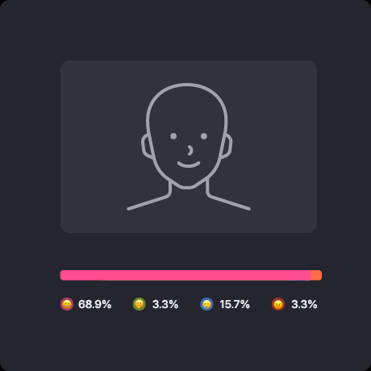
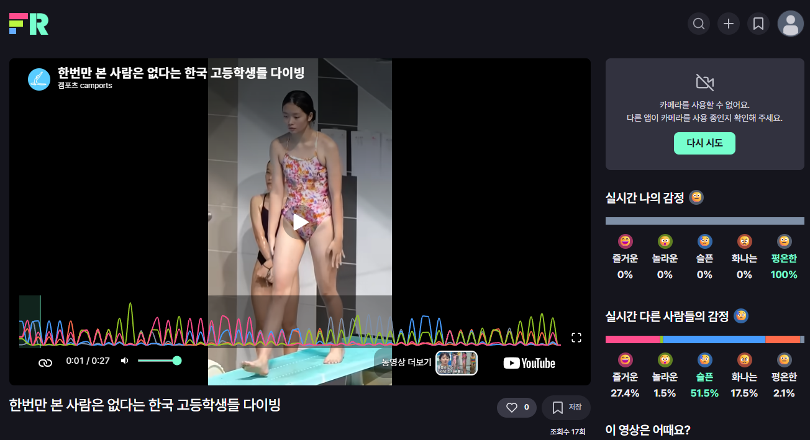
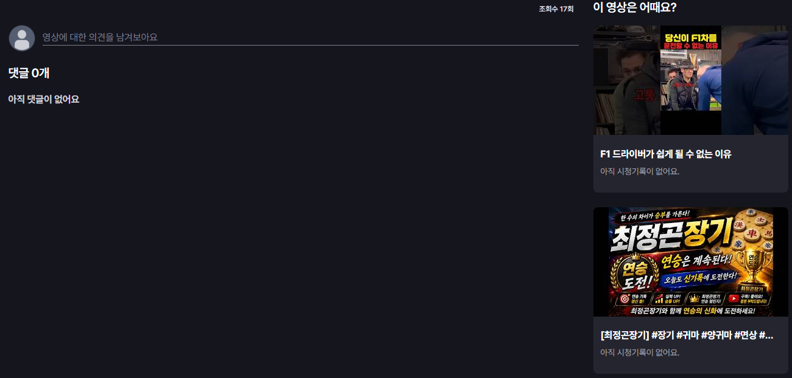
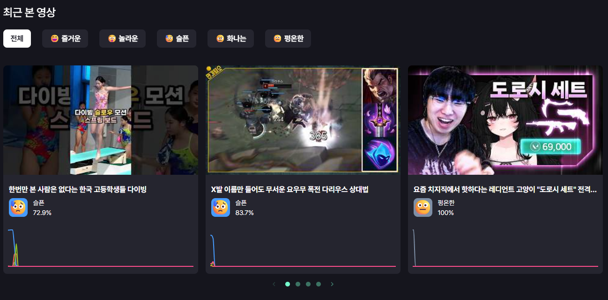

  

<h1 align="center">FaceReview</h1>

  <strong>표정이 남긴 감정으로 다음 영상을 발견하는 비디오 추천 서비스</strong>

2023.10 – 2023.12 · Team Project

---

## 프로젝트 소개

평점이 높아도 내게는 재미없고, 다른 사람의 혹평과 달리 의외로 재미있었던 경험에서 시작했습니다. 말로 남긴 리뷰만으로는 알기 어려운 취향을 **영상을 보는 순간의 감정**으로 이해할 수 있을지 고민했습니다.

FaceReview는 시청 중 표정을 감정 타임라인으로 만들고, 개인의 감정 기록과 영상별 반응을 연결해 다음 콘텐츠를 추천합니다. 접근하기 쉬운 YouTube 영상에서 시작했지만 영화·드라마·OTT 등 더 넓은 영상 경험으로 확장할 수 있도록 구상했습니다.

> **영상 발견 → 실시간 감정 분석 → 시청자 반응 비교 → 감정 기록 → 다음 영상 추천**

## 핵심 경험

### 1. 감정과 취향으로 영상을 발견합니다

최근 시청에서 쌓인 감정과 카테고리별 반응을 바탕으로 영상을 추천합니다. 개인화 추천뿐 아니라 카테고리, 검색, 즐겨찾기, 최신 영상 탐색도 함께 제공합니다.

#### 개인화 추천

#### 카테고리별 추천

### 2. 같은 순간의 감정을 함께 봅니다

웹캠 프레임을 5가지 감정으로 분석하고 영상 시점에 맞춰 기록합니다. 시청자는 자신의 현재 감정, 같은 순간 다른 시청자가 느낀 감정, 전체 영상의 감정 흐름을 한 화면에서 비교할 수 있습니다.

#### 실시간 감정 분석

  

#### 시청 화면과 감정 타임라인

### 3. 감정이 다음 추천으로 이어집니다

영상의 카테고리와 대표 감정을 기준으로 비슷한 반응을 이끌어낸 콘텐츠를 이어서 보여줍니다. 댓글과 연관 영상도 시청 흐름 안에서 함께 확인할 수 있습니다.

### 4. 나의 감정 기록을 돌아봅니다

최근 본 영상마다 어떤 감정을 느꼈는지 타임라인으로 다시 확인하고, FaceReview를 이용하며 쌓인 감정 분포를 돌아볼 수 있습니다.

### 5. 서비스 운영 정보를 한곳에서 관리합니다

백오피스에서는 회원, 영상, 영상 등록 요청, 댓글을 관리하고 서비스 상태와 이용 지표를 확인합니다.

## 주요 기능

| 영역 | 제공 기능 |
|---|---|
| 영상 탐색 | 개인화 추천, 카테고리 추천, 검색, 즐겨찾기, 최신순 무한 스크롤 |
| 감정 분석 | 웹캠 프레임 기반 5가지 감정 분석과 실시간 표시 |
| 함께 보는 감정 | 나의 현재 감정, 같은 시점의 전체 시청자 감정, 영상 전체 타임라인 비교 |
| 연관 추천 | 같은 카테고리와 대표 감정을 가진 영상 추천 |
| 마이페이지 | 최근 시청 영상의 감정 타임라인과 누적 감정 분포 조회 |
| 백오피스 | 회원·영상·영상 등록 요청·댓글 관리와 서비스 현황 확인 |

## 기술 구성

| 영역 | 기술 |
|---|---|
| Frontend | React, TypeScript, Zustand, TanStack Query, SCSS |
| Backend | Flask, Flask-SocketIO, Celery, APScheduler, Marshmallow |
| Emotion AI | TensorFlow, Keras, OpenCV |
| Data | MySQL, MongoDB, Redis |
| External API | YouTube Data API |
| Infrastructure | Docker, Gunicorn, Cloudflare |

## 프로젝트 저장소

- **Frontend** — [`joowon-jang/facereview-front`](https://github.com/joowon-jang/facereview-front)
- **Backend** — [`winterholic/facereview-refactor-back`](https://github.com/winterholic/facereview-refactor-back)
- **Backoffice** — [`winterholic/new-facereview-admin-front`](https://github.com/winterholic/new-facereview-admin-front)
